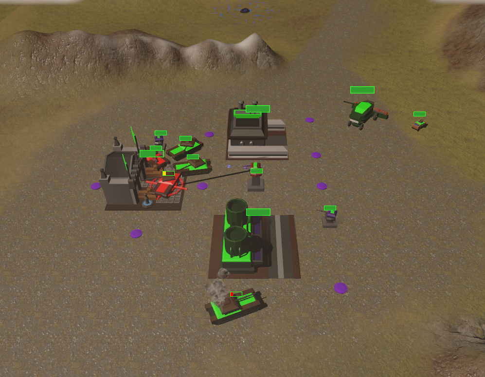
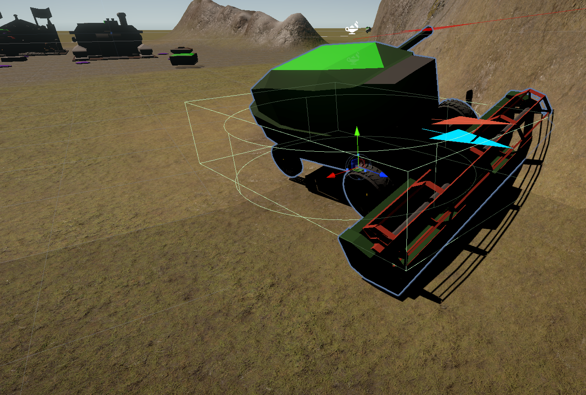
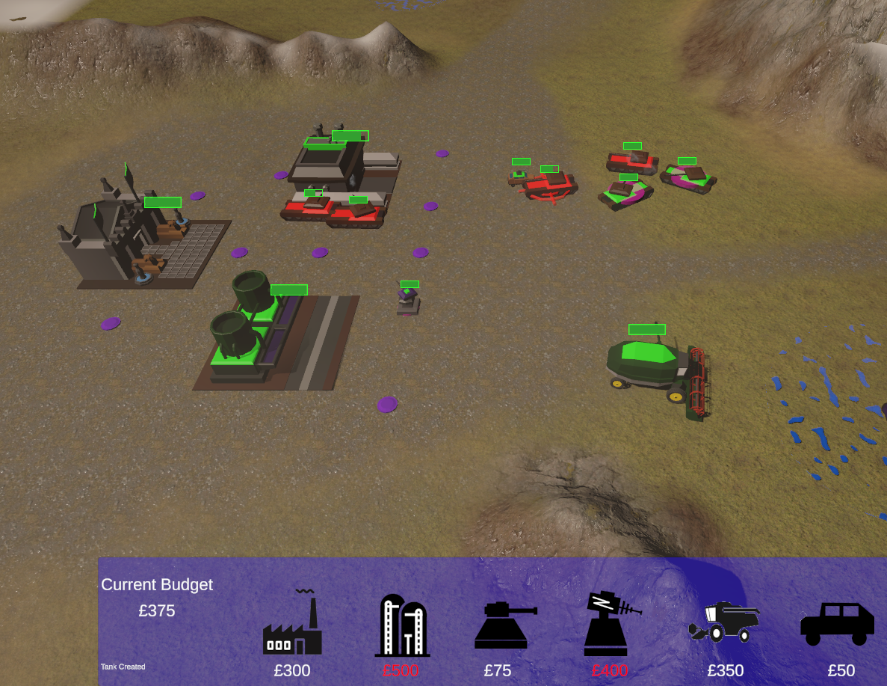
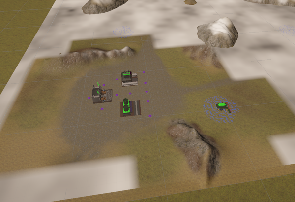
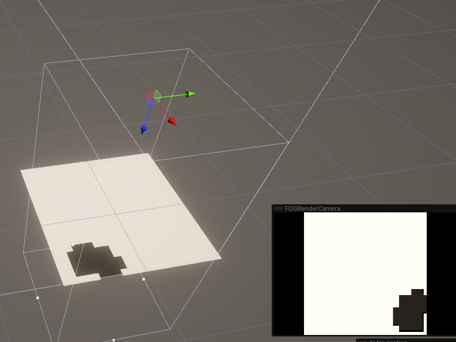
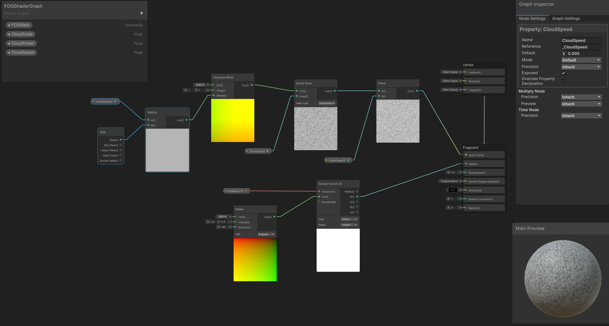

# A Basic RTS codebase
A Very Simple Real Time Strategy (RTS) code base made in Unity.

The Game can be played from your Browser at Simmer IO   (https://simmer.io/@JulesWombat/basic-rts)  It requires a PC, for Mouse Right and Left Click operations. 

I have played the classic C&C RTS games from the 1990s, and enjoyed the skirmish mode. I have often thought of the challenge to create a compelling and challenging RTS Enemy player. This is my attempt after many years of thought.  My previous attempt  used the Unity Real Time (RTS) Asset to help provide the core platform. This resulted in "Farmwars", which was kinda fun. However the enemy NPC player behvaiours was not under the develoepr control, and a little obscure.

The very simple RTS game for the Player (green) to play against an Game AI coordinated Red opponent. The Player and the Enemy each start with a Base, consisting of a Base Headquarters, Factory and a Refinary with a Harvester Unit. The Harvester will need to be sent off to hunt for Ore in a Ore fields distributed amonsgt the scene. The Player or Enemy can build either Humvees or Tanks as Units to go on the attack, or build either Gun  or Laser Turrest to defend their base.  The gamne is won, when either the Player or Enemy destroys the opponents Headquarters.  There is no Repair or sell modes, so there is careful budget management, especially if your Factory, Refinary or Harvestr are destroyed. Gun and Laser Defence Turrets can only be built upon Base Mount points, so as to ensure that its possible to code up the Enemy Defence builds.     

This project is a bottom up attempt to implement an interesting Enemy behaviours in direct code. The code as expected gets prestty complex and messy pretty quickly. Looked at Behvaioural Trees and State Transition diagrams, but to my mind these graphical methods did not not necessarily reduce complexity, than direct code. So the Unity C# scripts here are primarily based upon Units progressing States and Modes, expressed as a state variable against Enumerated state.  Combined with Random Variables and timeouts. 

## Implementation Notes ##

The Unity Package has been uploaded containing my code into this GIT repository. So most of the Assets and Code to run can be imported into a Unity Project. You will also need to Import Text Mesh Pro from Unity for the main User Interface, and some Grass, Mud, Rock Terrain textures from Third Party Packages. 

So the code is not pretty.  The main C# Script files are as follows, andhave been uploaded for view explicitly: 

-   GameManager.CS           :  This manages the overall RTS Mission Game. It spawns the Player and the Enemy Base.  
-   PlayerUserInterface.CS   :  This provides the user interface for the Player (Green)  
-   EnemyAIManager.CS        :  This the rather overblown Game AI coordinator code for the Enemy (Red) behaviours 
-   RTSComponent.CS          : This represents the RTS Units, Buildings and defence Turrets. Most of the code is manage Player, Enemy Unit movements and behaviours.  
-   BaseManager.CS           : This coordinates the Player/ Enemy Base. It is responsible for spawning Units, Defences as a function of returned Ore Budget. 
-   WeaponsManager.CS        : This is a sub component, of a Unit or Defence Turret to coodinate the Surveillance and Weapons fire management.
-   HarvesterManager.CS      : This specialisation of the RTS Component, to manage Harvesters search for Ore, and resturn their load to their base.
-   FogWarManager.CS         : This is used to manage the Fog Of War, which is a combinations of a second camera writing to a customer render texture, which feeds a FOG Shader  

  There are minor scripts to manage Orefields, Mount points, Camera control and the Main Menu Screen. 

### Enemy AI Implementation: Build Queue and Attack Assessments ###

Most of the "Interesting" code is managed within the EnemyAIManager.CS.  This is the scheduler forthe Enemy (AI) behaviours. It is based upon two core elements.
-   Build Strategy            :  A Build Queue, of what RTS components to build next. Based upon a combination of Random choice, and a number of Tactical hueristics
-   An Attack Assessment      :  Review how many Tanks or Humvees necessary to make a reasonable attack on the Enemy Harvester, Base etc.  The Enemy AI makes an assessment on Player Strength in number of Units protecting their Harvester, At base, or Base Defences, and chooses different Targets accordingly.  

The Build Strategy can be choice of: {None,Mixed,HumveeFest,HardTank,BuildEconomy,BuildDefences}
The Attack Targets could be one of : {None, Harvester,HarvesterEscorts,BaseSpecific,BaseDefences,BaseGeneral}

There are many Tactical Ploys. "Escort the Harvester", "Survey and Protect the Base", "Support local Units Under Attack", "Degrade Local Units". These are based upon local Tactical Assessments and Hueristics. 

Note you can view the AI behvaiours via a Backdoor keyboard. Press "D" For Debug. This will deactivate the Fog of War, and Display an AI Debug Window, with a few hueristics, the Build Queue, and the Attack Strategy if any. Press D again to disbale this backdoor. 
 

  
### Fog Of War Implementation ###
The Fog of War implementation is rather basic, but necessarily to hide the enemy intent.  This is implemented as a two part process.  

It uses a second (Orthogonal) Camera, that is viewing a 20x20 matrix Fog Mask segments. These are controlled by the FogWarManager. The FogWarManager switches FOG segments on or off, according to the location of Player Units. 

The FOG Camera is viewing these FOG Mask Segments matrix, and the renders its view into a Custom Render Texture. This Custom Render Texture is used as an input into a FOG Shader, which masks part of the FOG Overaly Plane Surface in the main scene.  

### Fog Of War Shader ###
The following Shader uses the Custom Render Texture ass an Input to Mask an overall Noise generated cloud Material (With some slowly moving Clouds, based upon a Time offset.

## Concluding Notes ##

The code is a bit of a mess, but the game play is quite compelling as a basic Skirmish mode.

The early game is to overcome a few waves of attack from the Enemy AI.  There are few mid map battles, the battles are around bases and the harvester escorts.  Once hte player has defeated a few waves, it is possible to turtlke, build up defences and a large force to overcome the enemy harvester escorts and kill off their harvesters.  However the end game can get quite tedious, as the Enemy will have built up large defences, so the game becoems a bit of a slugfest to overcome their built defences.  This seems typical of the old RTS games like Age of Empires. 

So there is some further balancing and refinement of the enemy attack and defence ploys.  

There are possible options to incorporate Repair and Sell options. (e.g. repair All Units slowly at own base) - However a general Repair, would be a little awkward to implment as a AI behiaviour. So the repair mode was dropped. Similarly the Player can get caught with no Harvester, or Funding, but many Defence Assets.  This is a lose situation, and it takes the enemy long time to take advantage, and kill off the player.  So the end game for both the Player and the Enemy AI player is very slow.

