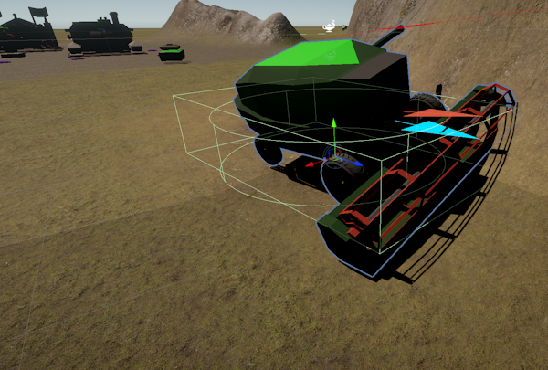
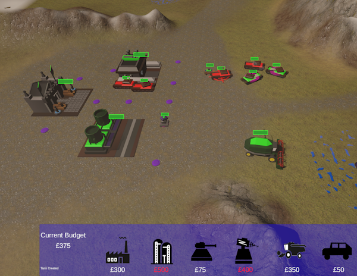

# A Basic RTS codebase
A Very Basic Real Time Strategy (RTS) Skirmish Mode code base made in Unity.

### Video Demo:  ###
See a Brief You Tube Video at:  https://www.youtube.com/watch?v=YUVWX5xAq6A

### Play The Game: ### 
The Game can be played from your Browser On Unity Play : ( https://play.unity.com/en/games/df15c77d-9144-48e0-a04d-c201e68c828c/webglbuild ) It requires a PC, for Mouse Right and Left Click operations. 

Having played the classic C&C RTS games from the 1990s, and enjoyed the skirmish modes,  I have often thought of the challenge to create a compelling and challenging RTS Enemy Skirmish mode player. This is my attempt after many years of thought.  

My previous attempt  used the Unity Real Time (RTS) framework Asset to help provide the core platform. This resulted in my "FarmWars" game, See (https://www.youtube.com/watch?v=_BvcVxDoaak)   which was kinda fun. However the enemy NPC player behaviours were not under the develoepr control, and were a little obscure to get compelling behaviours.

## Game Overview ##
This very simple RTS game requires the Player (green) to play against an Game AI coordinated Red opponent. The Player and the Enemy each start with a Base, consisting of a Base Headquarters, Factory and a Refinary with a Harvester Unit. The Harvester will need to be sent off to hunt for Ore in a Ore fields distributed amongst the scene. The Player or Enemy can build either Humvees or Tanks as Units to go on the attack, or build either Gun  or Laser Turrets to defend their base.  The mission is won, when either the Player or Enemy destroys the opponents Headquarters.  There are no Repair or sell modes, so this requires careful budget and risk management, especially if your Factory, Refinary or Harvester are destroyed. Gun and Laser Defence Turrets can only be built upon Base Mount points, so as to enable easy coding to place Enemy AI Defence positions.     

This project is a bottom up attempt to implement interesting Enemy behaviours in direct code, rather than use any existing RTS framework. The code, as expected quickly gets pretty complex and messy. Behavioural Trees and State Transition diagrams were considered, but to my mind these graphical methods did not not necessarily reduce complexity, any more than writing behvaiours into direct code. I am also more comfortable refactoriung code, than in sub dividing and factoring diagrams and graphs.  So the Unit behaviours within the Unity C# scripts here are primarily implemented around the progress of Unit States and Modes. These are implemented as a progress of  Enumerated type state variables.  These Unit State variables are progressed depending upon a combination of Random variables, huerisitics and timeouts to provide basic enemy behaviours. 

## Implementation Notes ##

The Unity Package has been uploaded containing my code into this GIT repository. So most of the Assets and Code to run can be imported into a Unity Project. You will also need to Import Text Mesh Pro from Unity for the main User Interface, and some Grass, Mud, Rock Terrain textures from Third Party Packages. 

The main C# Script files are as follows, and have been uploaded for view explicitly: 

-   GameManager.CS           :  This manages the overall RTS Mission Game. It spawns the Player and the Enemy Base.  
-   PlayerUserInterface.CS   :  This provides the user interface for the Player (Green)  
-   EnemyAIManager.CS        :  This ia a rather overblown Game AI coordinator code for the Enemy (Red) behaviours 
-   RTSComponent.CS          : This represents the core RTS Units, Buildings and defence Turrets. Most of the code to manage Player, Enemy Unit movements and behaviours.  
-   BaseManager.CS           : This coordinates the Player/ Enemy Base. It is responsible for spawning Units, Defences as a function of returned Ore Budget. 
-   WeaponsManager.CS        : This is a sub component, of a Unit or Defence Turret to coodinate the Surveillance and Weapons fire management.
-   HarvesterManager.CS      : This specialisation of the RTS Component, to manage Harvesters search for Ore, and return their load to their base.
-   FogWarManager.CS         : This is used to manage the Fog Of War, which is a combinations of a second camera writing to a customer render texture, which feeds a FOG Shader  

  There are minor scripts to manage Orefields, Mount points, Camera control and the Main Menu Screen. 

### Enemy AI Implementation: Build Queue and Attack Assessments ###

Most of the "Interesting" code is managed within the EnemyAIManager.CS.  This is the scheduler for the Enemy (AI) behaviours. It is based upon two core elements.
-   Build Strategy            :  A Build Queue, of what RTS components to build next. Based upon a combination of Random choice and a number of Tactical hueristics
-   An Attack Assessment      :  Review how many Tanks or Humvees necessary to make a reasonable attack on the Enemy Harvester, Base etc.  The Enemy AI makes an assessment on Player Strength in number of Units protecting their Harvester, or at their base, or number of Base Defences, and chooses different Targets accordingly.  

Within the Main Fixed Update cycle there is a One second Tactical Assessment, to Assess the tactical situation (Number of Player Harvesters, Tanks, Base Defences vs the Enemies own numbers), in addition to any current Attacks on Base, Harvesters or own Units, to respond to. Then there is cycle period of around every minute to Reassess the Current Build Strategy. Initially set to random, the Build Strategy is modified according to the current Tactical heuristics, Random adjustments and Attack Assessments which is also made within the Strategy loop period. This counts the likely number of Humvees or Tanks necessary for a probable attack success.    

The Build Strategy can be choice of: {None, Mixed, HumveeFest, HardTank, BuildEconomy, BuildDefences}
The Attack Target Mode could be one of : {None, Harvester, HarvesterEscorts, BaseSpecific, BaseDefences, BaseGeneral}

There are many Tactical Ploys. "Escort the Harvester", "Survey and Protect the Base", "Support local Units Under Attack", "Degrade Local Units". These are based upon local Tactical Assessments and Hueristics. 

Theier are some 'cheat' ploys on behalf of the AI, to balance the Enemy Unit forces and Economy against the player, to make more interesting/ partially informed AI game play, and residual income to overcome late game. 

Note you can view the AI behaviours via a Backdoor keyboard. Press "D" For Debug. This will deactivate the Fog of War, and Display an AI Debug Window, and will display just a few of the tactical hueristics, the Build Queue, and the Attack Strategy if any. This will provide an insight (and cheat) on what the Enemy Game AI has assessed and scheduled to occur next. Press D again to disable this backdoor. 
 

  
### Fog Of War Implementation ###
The Fog of War is a very very basic implementation, but necessarily to hide the enemy intent.  This is implemented as a two part process.  

It uses a second (Orthogonal) Camera, that is viewing a 20x20 matrix Fog Mask segments. These are controlled by the FogWarManager. The FogWarManager switches FOG segments on or off, according to the location of the Player Units locations in the scene. 

The FOG Camera is viewing these FOG Mask Segments matrix, and then renders its view into a Custom Render Texture. This Custom Render Texture is then used as an input into a FOG material Shader, which which is applied across a FOG Overaly Plane Surface in the main scene. 

### Fog Of War Shader ###
The following Shader uses the Custom Render Texture ass an Input to Mask an overall Noise generated cloud Material (With some slowly moving Clouds, based upon a Time offset.

## Concluding Notes ##

The code is a bit of a mess, but the game play is quite compelling as a basic Skirmish mode.

The early game is to overcome a few waves of attack from the Enemy AI.  There are then typically a few mid map battles, the battles are around bases and the harvester escorts.  Once the player has defeated a few waves, it is then possible to defend and turtle, by building up defences and a large unit force to overcome the enemy harvester escorts and kill off their harvesters.  However the end game can get quite tedious, as the Enemy will typically have built up large defences, so the game becomes a bit of a slugfest to overcome their built defences.  This seems typical of the old RTS games like Age of Empires, where afetr overcomming the map control, you ended up entering their base, only to encounter a massive turtled army defending it. 

So there is some further balancing and refinement of the enemy attack and defence ploys.  

There are possible options to incorporate Repair and Sell options. (e.g. repair All Units slowly at own base) - However a general Repair, would be a little awkward to implement as a AI behiaviour. So the repair mode was dropped. Similarly the Player can get caught with no Harvester, or Funding, but many Defence Assets.  This is a lose situation, but the enemy does not recognise, and it takes the enemy a long time to take advantage, and kill off the player.  So the end game for both the Player and the Enemy AI player is very slow and tedious.

